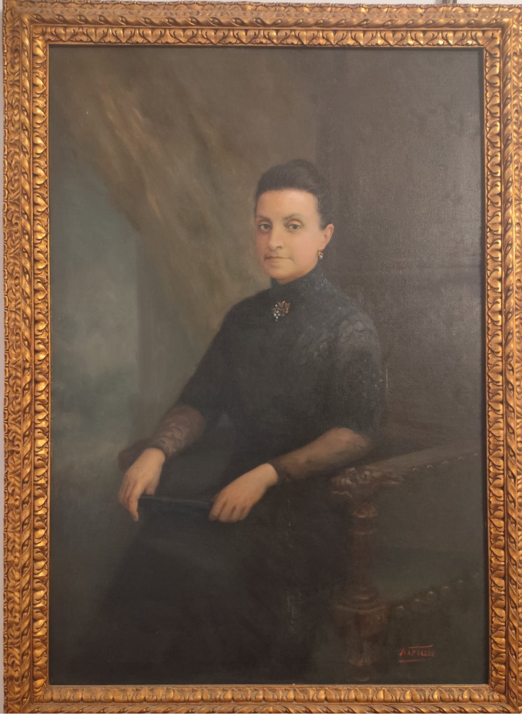
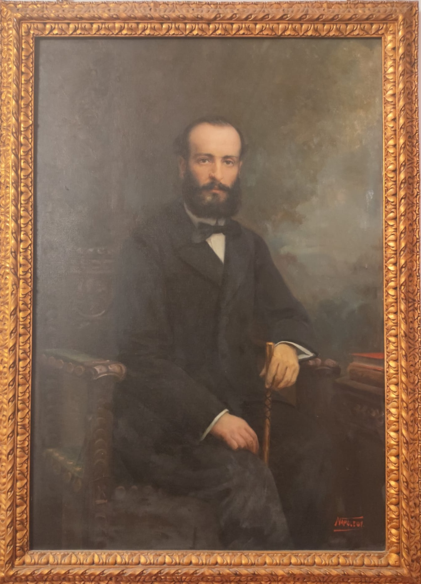

# 🖼️ Proyecto de Realidad Aumentada con Unity

Este repositorio contiene los archivos principales (`Assets/` y `Packages/`) de un proyecto desarrollado en Unity para una experiencia de Realidad Aumentada.

> ⚠️ Debido a las limitaciones de tamaño de GitHub/GitLab, **solo se han subido las carpetas esenciales del proyecto**. Carpetas como `Library`, `Temp`, `Build`, `Logs` y otras generadas automáticamente por Unity no se han incluido.

---

## 📦 ¿Qué incluye este repositorio?

- `Assets/`: Todo el contenido del proyecto: escenas, scripts, materiales, texturas, etc.
- `Packages/`: Paquetes necesarios para que Unity descargue automáticamente las dependencias del proyecto.
- `.gitignore`: Fichero que evita subir contenido pesado o innecesario al repositorio.
- `README.md`: Esta guía paso a paso para reconstruir el proyecto.

---

## 🛠️ Requisitos

- Unity Hub instalado: [https://unity.com/download](https://unity.com/download)
- Versión recomendada de Unity: **[6000.0.47f1]**
- Conexión a Internet para que Unity pueda reconstruir carpetas y descargar dependencias automáticamente

---

## 🚀 Cómo abrir y usar este proyecto paso a paso

### 🧩 1. Descargar el proyecto

Tienes dos formas:

#### A. Descargando el ZIP

1. Haz clic en el botón verde **`<> Code`** > **Download ZIP**
2. Extrae el contenido en cualquier carpeta de tu ordenador

#### B. Clonando el repositorio (si tienes Git instalado)
  git clone https://github.com/tu_usuario/tu_repositorio.git

## 🧪 Prueba la experiencia

Puedes probar el sistema desde un navegador compatible con WebXR (como Chrome en móvil). Abre la cámara y apunta a uno de los cuadros siguientes:

### 📌 Cuadro: Ignàsia Martorell
  

### 📌 Cuadro: Tomàs J. Salort
  

> 💡 Puedes descargar estas imágenes o mostrarlas en pantalla para simular la prueba.
